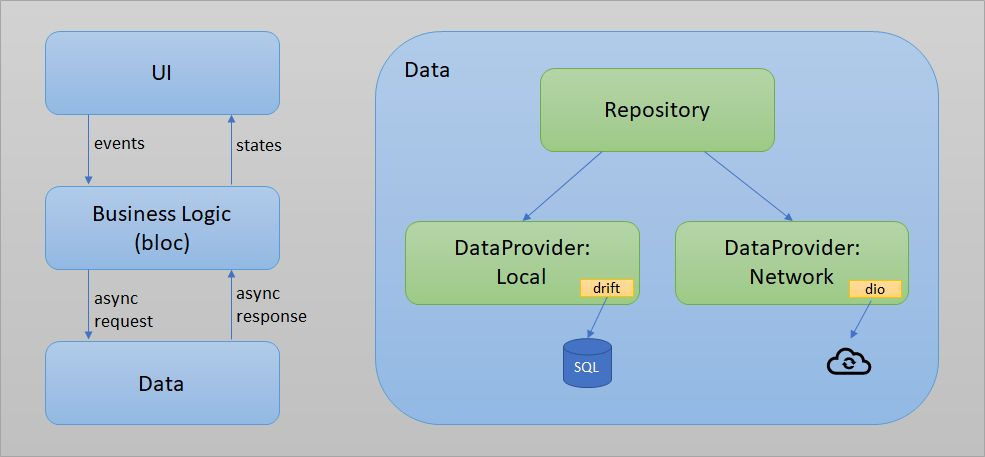

# Learning Flutter

For our new project we decided to use flutter. The app should run on desktops, Android tablets, iOS tablets and the web. Soon I realized, there are many best practices, many sources, many possibilities to do things right. As usual, there is more than one way of doing it right :wink: In this repository I share my learnings and experiences. In addition, I explain, how I will set up the new project and why I do it the way I do it. Following the commit history, you may understand each step. The result is a simple app using all the mentioned and chosen packages and approaches. Have fun :smile: 

## VS Code
List of helpful extensions, most coming from 
- general (helpful for many programming languages)
  - [Prettier - Code formatter](https://marketplace.visualstudio.com/items?itemName=esbenp.prettier-vscode)
  - [Error Lens](https://marketplace.visualstudio.com/items?itemName=usernamehw.errorlens)
  - [Rainbow Brackets](https://marketplace.visualstudio.com/items?itemName=2gua.rainbow-brackets)
- required
  - [Flutter](https://marketplace.visualstudio.com/items?itemName=Dart-Code.flutter) -- includes installation of extension Dart
- optional, most coming from [Essential VS Code extensions for Flutter](https://blog.logrocket.com/essential-vs-code-extensions-for-flutter/) - time will show, which of them I really use ...
  - architecture - you will not need both
    - [bloc](https://marketplace.visualstudio.com/items?itemName=FelixAngelov.bloc) -- I will use bloc
    - [GetX Snippets](https://marketplace.visualstudio.com/items?itemName=get-snippets.get-snippets) -- quick and easy and maybe quick and dirty ...
  - code generation
    - [Awesome Flutter Snippets](https://marketplace.visualstudio.com/items?itemName=Nash.awesome-flutter-snippets)
    - [Flutter Tree](https://marketplace.visualstudio.com/items?itemName=marcelovelasquez.flutter-tree)
    - [Better Flutter Tests](https://marketplace.visualstudio.com/items?itemName=andreasblech.better-tests)
    - [flutter_mobx - refactoring help](https://marketplace.visualstudio.com/items?itemName=Flutterando.flutter-mobx)

## Flutter installation
Check flutter installation
```cmd
flutter doctor
```
Clean up installation
```cmd
flutter clean
flutter pub cache repair
flutter pub get
```
## Build/Debug
Android: start emulator first, select it on the bottom of vs code and press f5
Debug web app
```cmd
flutter run -d chrome
```
Build windows app
```cmd
flutter build windows
```
Tuning
- - https://docs.flutter.dev/development/platform-integration/web/renderers


## Specialities of Dart -- coming from Kotlin, ...
- no type declaration necessary, nevertheless strongly typed
- everything is an object, even ints
- type Runes (emojis, utf32 strings -- normal String is utf8)
- new is optional and should be omitted
- abstract instead of interface, i.e. dows not know the word interface
- all classes have an implicit interface, i.e. no need to define an abstract class to support mocking
- single inheritance
- supports optional parameters
- null safety as in Kotlin with ?
- operators like ?:
- no public, private, protected, private for lib by naming prefix _, hence default is public
- import of only a part of a library `import 'package:lib1/lib1.dart' show foo;`
- supports async/await
- list looks like an array
- as in Python
```dart
var listOfInts = [1, 2, 3];
var listOfStrings = ['#0', for (var i in listOfInts) '#$i'];
```

## Interesting Flutter libs
Inspired by wonderous example app and the [architecture links](###Architecture), ordered alphabetically. Required/with the project generated libs not included. The descriptions are taken from the packages itself. I plan to use all the mentioned libs in my project.
If you look for libraries make sure, they support the platforms you want (use filter on the left) and check the scores.
- [cached_network_image](https://pub.dev/packages/cached_network_image): Flutter library to load and cache network images. Can also be used with placeholder and error widgets.
- [dio](https://pub.dev/packages/dio): A powerful Http client for Dart, which supports Interceptors, FormData, Request Cancellation, File Downloading, Timeout etc.
- [equatable](https://pub.dev/packages/equatable): A Dart package that helps to implement value based equality without needing to explicitly override == and hashCode.
- [flex_color_scheme](https://pub.dev/packages/flex_color_scheme) -- very usable and easy way to define your thema, including playground. A Flutter package to use and make beautiful Material design based themes.
- [flutter_bloc](https://pub.dev/packages/flutter_bloc): Flutter Widgets that make it easy to implement the BLoC (Business Logic Component) design pattern. Built to be used with the bloc state management package. 
- [flutter_launcher_icons](https://pub.dev/packages/flutter_launcher_icons): A package which simplifies the task of updating your Flutter app's launcher icon.
- [flutter_native_splash](https://pub.dev/packages/flutter_native_splash): Customize Flutter's default white native splash screen with background color and splash image. Supports dark mode, full screen, and more.
- [get_it](https://pub.dev/packages/get_it): Simple direct Service Locator that allows to decouple the interface from a concrete implementation and to access the concrete implementation from everywhere in your App"  
- [logger](https://pub.dev/packages/logger): Small, easy to use and extensible logger which prints beautiful logs. 
- [mockito](https://pub.dev/packages/mockito): A mock framework inspired by Mockito with APIs for Fakes, Mocks, behavior verification, and stubbing.
- [responsive_framework](https://pub.dev/packages/responsive_framework): Easily make Flutter apps responsive. Automatically adapt UI to different screen sizes. Responsiveness made simple.

Maybe later or for other projects
- https://pub.dev/packages/flutter_cache_manager
- [injectable](https://pub.dev/packages/injectable): Injectable is a convenient code generator for get_it. Inspired by Angular DI, Guice DI and inject.dart. 
- [drift](https://pub.dev/packages/drift): Drift is a reactive library to store relational data in Dart and Flutter applications. 
- [freezed](https://pub.dev/packages/freezed): Code generation for immutable classes that has a simple syntax/API without compromising on the features. 
- [pretty_dio_logger](https://pub.dev/packages/pretty_dio_logger): Pretty Dio logger is a Dio interceptor that logs network calls in a pretty, easy to read format. 
- [styled_widget](https://pub.dev/packages/styled_widget): Simplifying your widget tree structure by defining widget using methods. Taking ispiration from CSS and SwiftUI
- https://pub.dev/packages/collection
- [flutter_secure_storage](https://pub.dev/packages/flutter_secure_storage): Flutter Secure Storage provides API to store data in secure storage. Keychain is used in iOS, KeyStore based solution is used in Android. 


## Learning path - plan to implement a simple app using the resources and libs listed
I decided to use basically bloc and hence the repository pattern (see [Android Developers: Architecture](https://developer.android.com/topic/architecture) and [Bloc: Architecture](https://bloclibrary.dev/#/architecture). 
The repository helps to adapt/prepare/union the data, as it is needed by the domain. The repository makes it easy to implement caching, as the data may come from a network provider (or even many of them) or a local provider. Basically, the
repository exposes the data for the domain layer.
The following
picture illustrates the resulting architecture -- although I will not implement the local caching for the time being. As [service locator](https://en.wikipedia.org/wiki/Service_locator_pattern) I will use get_it.

After each step: test Android, Windows, Chrome
1. create the app following [Get started
Test drive ](https://docs.flutter.dev/get-started/test-drive)
  - The template did not ask for a package name. Used notepad++ file search ... -- this is very tedious lateron ....
  - tested created project on Android, Windows (exe found in src\findus\build\windows\runner\Release), Chrome -- see [Build/Debug](##Build/Debug)
2. add internationalization -- otherwise extracting all the strings later is a hassle
  - following instractions of https://docs.flutter.dev/development/accessibility-and-localization/internationalization -- you need to add the lines step by step, as described, do not tempt to do two steps at once ...
  - after adding a string you might need to run `flutter gen-l10n`
  - as it is quite a lot of code to use the strings, I copied the approach of the wonderous app and hence needed to use get_it already
3. define theme with colors
  - select a color schema using [coolors](https://coolors.co/) and [material](https://material.io), check/tune [contrast](https://contrast-ratio.com/)
  - use [flex_color_scheme](https://pub.dev/packages/flex_color_scheme) and the [playground](https://rydmike.com/flexcolorscheme/themesplayground-v5/#/) to generate the schema, as this is important in general, I chose the quick tour and missed the contrast check...
4. own logo/app icon
  - use [flutter_launcher_icons](https://pub.dev/packages/flutter_launcher_icons)-- do not forget to call `flutter pub run flutter_launcher_icons:main`
  - if you add more specific icons and go back to a general one, not all settings will be replaced, use carefully
5. make it responsive using package [responsive_framework](https://pub.dev/packages/responsive_framework)
6. encapsulate home screen
7. refactor internationalization
  - somehow I did not like the implementation with $strings, e.g. it did not handle missing translations properly
  - first I undid all changes of 2. --> commit 
  - follow instructions of 
    - https://docs.flutter.dev/development/accessibility-and-localization/internationalization
    - https://medium.com/@Albert221/how-to-internationalize-your-flutter-app-with-arb-files-today-full-blown-tutorial-476ee65ecaed
  - choose your output-class wisely, as later changes are a hassle, good mix of readability, minimum typing and no confusion with other types
  - conclusions: Seems to me much simpler and better to understand. The current configuration in l10n.yaml specifies untranslated_messages.txt as location for untranslated strings, i.e. with each build this list will be generated. However, in case of an missing translation the default of en will be used.
8. add bloc, get_it, go_router 
  - do not forget to save the yaml file after adding the dependencies, before you continue --> fetches the packages
  - good explanation and introduction to bloc: https://bloclibrary.dev/#/gettingstarted or https://medium.com/flutter-community/flutter-bloc-package-295b53e95c5c
  - first use bloc in the home page (counter) similar to https://medium.com/vijay-r/flutter-bloc-pattern-simple-cubits-a860549738eb even better would be https://bloclibrary.dev/#/fluttercountertutorial
  - add go_router 
  - add get_it
  - decided against injectable, maybe later, but even in https://betterprogramming.pub/flutter-clean-architecture-test-driven-development-practical-guide-445f388e8604 not needed/used
9. add a splash screen using flutter_native_splash, follow the instructions of https://pub.dev/packages/flutter_native_splash
10. add simple dummy server based on python fastapi and mariadb running in docker
11. implement kind of repository patern, fetch data from demo api using dio
  - add folders
  - tried freezed and decided against it, although it reduces the code, at the moment I prefere to really see and understand, what I do ;-)
  - add dio
  - [What is the alternative to a ListView in Flutter?](https://docs.flutter.dev/get-started/flutter-for/android-devs#listviews--adapters)
  - fetch data from api using dio, use stream instead of future for getall, see https://bloclibrary.dev/#/fluttertodostutorial
    - somehow I used wrong urls, make sure they work ...
	- sometimes the server needs to be restarted, check in your browser with http://localhost:8004/animal
	- android emulator does not work with localhost, hence check your ip with netstat and put it into src\findus\lib\data\constants.dart
ToDo
12. add tests using mockito
17. dart_code_metrics
18. many things to do from here, e.g.
  - add crud operations in animal list
    - animal_details screen with editable fields
	- cubit for one animal, inform list of changes
	- navigation
  - unify imports
  - split into reasonable packages
  - extract all strings into arb files
  - add intelligent local caching
  - tune design ;-)

## Resources
Collection of articles to read again and again ...
### Dart
- https://dart.dev/guides
- https://dart.dev/guides/language/language-tour
- https://dart.dev/guides/language/language-tour#asynchrony-support

### Flutter
- https://docs.flutter.dev/
- Coming from Android
  - https://docs.flutter.dev/get-started/flutter-for/android-devs 
  - https://burhanrashid52.medium.com/flutter-for-android-developers-how-to-design-activity-ui-in-flutter-4bf7b0de1e48 

### Architecture
- https://codewithandrea.com/articles/flutter-repository-pattern/
- https://betterprogramming.pub/flutter-clean-architecture-test-driven-development-practical-guide-445f388e8604 -- from my point of view, a bit too much
- [GetX VS Bloc](https://xceltec.blogspot.com/2022/05/getx-vs-bloc-which-one-is-best-for-flutter-app-development.html) -- I follow the arguments and will use bloc. Most convincing arguments: no sponsors (>100 contributors), anti patterns, bad testability 
- [caching implementation](https://github.com/AbedElazizShe/flutter_clean_architecture)
- [packages](- https://docs.flutter.dev/development/packages-and-plugins/developing-packages)
- https://petercoding.com/flutter/2021/07/21/using-get-it-in-flutter/
- Docker: cirrusci/flutter:latest

### Navigation
I decided to use go_router instead of autoroute, because go_router does not need a special code generation and is easyer to understand.
- [Flutter Navigation with GoRouter: Go vs Push](https://codewithandrea.com/articles/flutter-navigation-gorouter-go-vs-push/)
The app developed here uses a very basic navigation. More complex examples see
- https://codewithandrea.com/articles/flutter-bottom-navigation-bar-nested-routes-gorouter-beamer/
or with login-page
- https://www.raywenderlich.com/28987851-flutter-navigator-2-0-using-go_router

### Testing
- [Testing Flutter apps](https://docs.flutter.dev/testing)
- [An introduction to integration testing](Integration-Tests: https://docs.flutter.dev/cookbook/testing/integration/introduction)

### Example apps
- https://github.com/codestronaut/flutter-weather-app-sample
- https://github.com/gskinnerTeam/flutter-wonderous-app
- https://github.com/jhomlala/feather
- https://github.com/burhanrashid52/WhatTodo

### Design
- https://www.figma.com/community/plugin/844008530039534144/FigmaToFlutte
- https://api.flutter.dev/flutter/material/ThemeData-class.html

### Articles/Packages to be analyzed
- https://medium.com/flutter-community/offline-first-with-flutter-be1e8335d976
- [issue to render web app inside custom html element](https://github.com/flutter/flutter/issues/32329)

Any comments appreciated :smile: